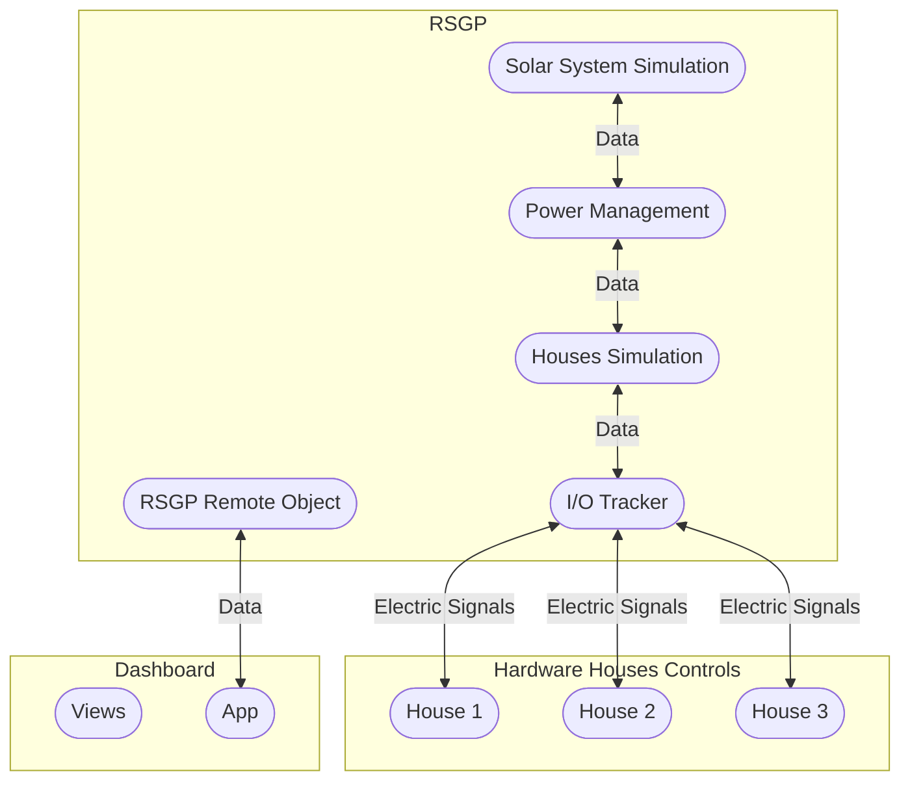
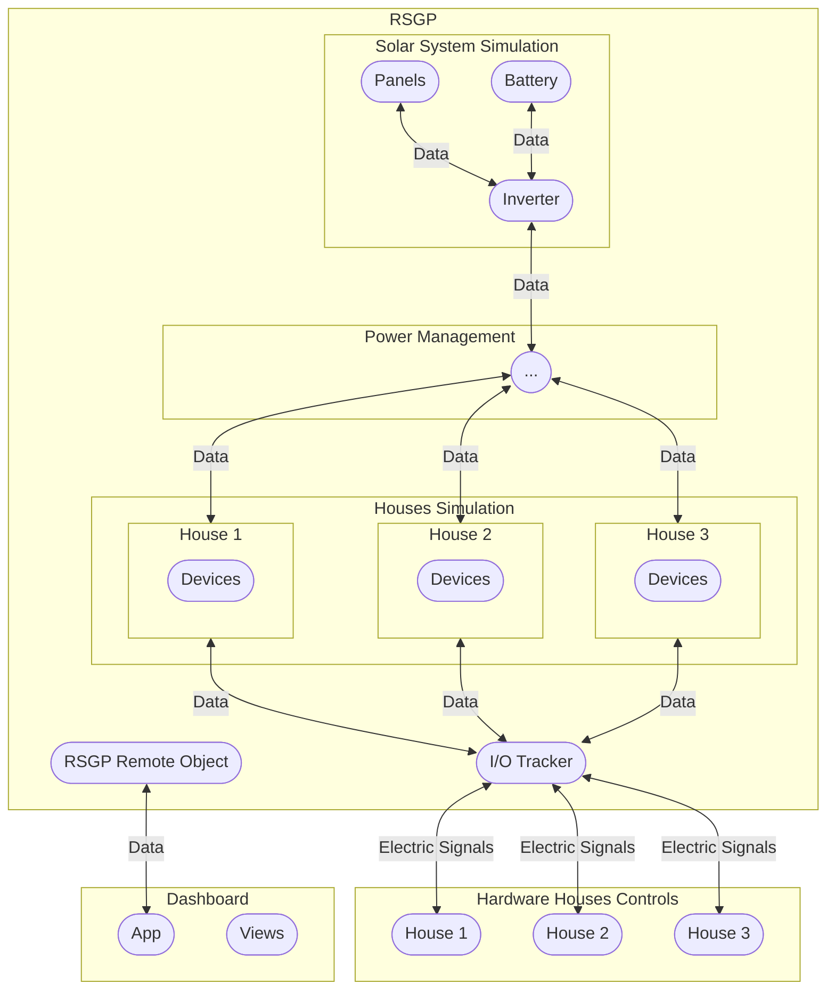

# Residential Smart Grid Prototype (RSGP)

A comprehensive simulation framework that addresses energy distribution inefficiencies in residential solar systems. The project implements an intelligent power management system that coordinates energy allocation among houses with varying consumption patterns and renewable generation capabilities, minimizing grid dependence through virtual battery allocation and adaptive learning algorithms.

## 🌟 Features

### Core Simulation Components

- **Houses Simulation** - ADSR envelope modeling for realistic device behavior and energy consumption patterns
- **Solar System Simulation** - PV panels, battery storage, and inverter simulation using NSRDB data with pvlib/pvwatts libraries
- **Power Management** - Virtual battery allocation with statistical learning algorithms and adaptive weight adjustment
- **Time Simulation Engine** - Synchronized timestep coordination with configurable acceleration factors
- **Remote Object Interface** - Distributed architecture using Pyro5 for component communication

### Key Capabilities

- **Virtual Battery System** - Fair energy allocation among houses based on consumption patterns
- **Adaptive Learning** - Statistical analysis with normalized load deviation calculations
- **Real-time Coordination** - Synchronized simulation across distributed components
- **NSRDB Integration** - Authoritative solar irradiance data for accurate modeling
- **Hardware Interface** - Raspberry Pi GPIO controller with physical interaction capabilities
- **Comprehensive Logging** - Timestamped CSV data export for analysis and validation

## 🏗️ Architecture

The system consists of multiple simulation components running concurrently with a sophisticated power management system.

### System Overview



### Detailed Architecture



## 🚀 Quick Start

### Prerequisites

- Python 3.8+
- pip package manager

### Installation

1. **Clone the repository**

   ```bash
   git clone <repository-url>
   cd residential-smart-grid
   ```

2. **Install dependencies**

   ```bash
   pip install -r requirements.txt
   ```

3. **Run the simulation**

   ```bash
   python -m rsgp
   ```

4. **Launch the dashboard** (in a separate terminal)
   ```bash
   python -m dashboard
   ```

5. **Launch the Raspberry Pi controller** (optional, requires GPIO setup)
   ```bash
   python -m rasp_controller
   ```

### First Run

1. Start the RSGP simulation - initializes houses, solar system, and power management components
2. Launch the dashboard for real-time monitoring and control capabilities
3. Optionally run the GPIO controller for hardware interaction
4. Monitor energy flows, virtual battery allocations, and system performance
5. Check timestamped directories in `rsgp/_logs/` for simulation data

## 📖 Usage

### Running Simulations

**Start the main simulation:**

```bash
python -m rsgp
```

**Launch the monitoring dashboard:**

```bash
python -m dashboard
```

**Launch the hardware controller:**

```bash
python -m rasp_controller
```

**Run analysis notebooks:**

```bash
marimo run notebooks/rsgp_logs_visualization.py
marimo run notebooks/nsrdb_visualization.py
marimo edit notebooks/graphs_editor.py
```

**Stop simulation:**
Use `Ctrl+C` to gracefully shutdown all simulation components.

### Configuration

Modify simulation parameters in `rsgp/config/settings.py`:

```python
# Solar System Configuration
BATTERY_CAPACITY = 100_000  # Wh
PANELS_NUM = 80
PANEL_EFFICIENCY = 0.15

# Houses Configuration
HOUSES_NUM = 12

# Time Simulation
TIME_FACTOR = 3600  # 1 hour simulation = 1 second real time
```

### Data Analysis

Explore the Marimo notebooks in `notebooks/` for:

- RSGP simulation data visualization and analysis
- NSRDB solar irradiance data exploration  
- Interactive graph editing and data processing
- System performance metrics and validation

## 📊 System Specifications

### Solar System

- **Solar Panels**: 80 panels × 1.6m² × 15% efficiency
- **Battery Storage**: 100 kWh capacity with 95% efficiency
- **Inverter**: 15kW AC rating with multiple operating modes
- **Weather Data**: NSRDB integration for realistic solar irradiance

### Residential Loads

- **Houses**: Configurable number of residential units (default: multiple houses)
- **Load Modeling**: ADSR envelope patterns for realistic device behavior
- **Device Categories**: Refrigerator, HVAC, Water Heater, and other appliances
- **Power Control**: Individual load line and utility line management per house

### Power Management

- **Virtual Battery System**: Dynamic allocation based on consumption patterns
- **Adaptive Learning**: Statistical weight adjustment with fairness constraints
- **Distribution Algorithm**: Weighted power allocation among houses
- **Load Balancing**: Real-time coordination and grid interface management

## 🔧 Development

### Project Structure

```
residential-smart-grid/
├── rsgp/                      # Main simulation package
│   ├── houses_sim/           # Houses simulation with ADSR device modeling
│   ├── solar_system_sim/     # Solar system with panels, battery, and inverter
│   ├── power_mng/            # Virtual battery and adaptive learning algorithms
│   ├── utils/                # Time simulation, logging, and remote objects
│   └── config/               # Configuration settings
├── dashboard/                # tkinter/ttkbootstrap GUI interface
├── rasp_controller/          # Raspberry Pi GPIO hardware controller
├── docs/                     # Sphinx documentation (bilingual EN/AR)
├── notebooks/                # Marimo analysis notebooks
└── requirements.txt          # Python dependencies
```

### Key Dependencies

- **pvlib/pvwatts**: Solar irradiance modeling and PV system calculations
- **Pyro5**: Distributed object communication and remote interfaces
- **numpy/pandas**: Scientific computing and data manipulation
- **tkinter/ttkbootstrap**: GUI framework for dashboard
- **marimo**: Interactive notebook environment for data analysis
- **lgpio**: Raspberry Pi GPIO control library
- **sphinx**: Documentation generation with bilingual support

## 📚 Documentation

Comprehensive bilingual documentation is available in the `docs/` directory:

- **Build English HTML**: `cd docs && make html-en`
- **Build Arabic HTML**: `cd docs && make html-ar`
- **Build English PDF**: `cd docs && make latex-en`
- **Build Arabic PDF**: `cd docs && make latex-ar`

Documentation covers:

- Houses simulation and ADSR device modeling
- Solar system simulation with NSRDB integration
- Power management and virtual battery algorithms
- Dashboard and hardware controller interfaces
- Results validation and system analysis
- API reference and development workflows

## 📈 Monitoring & Logging

### Real-time Dashboard

The dashboard provides:

- Real-time system status and component states
- Houses simulation monitoring with device controls
- Solar system generation and battery status
- Power management algorithm performance
- Virtual battery allocation visualization

### Data Logging

- **CSV Data**: Timestamped directories in `rsgp/_logs/` with separate files for each component
- **Houses Data**: `houses_simulation.csv` with device loads and connectivity states
- **Solar Data**: `solar_system_simulation.csv` with generation and battery metrics
- **Power Management**: `power_management.csv` with virtual battery states and allocations

### Performance Metrics

Key performance indicators include:

- Grid dependence reduction ratio
- Virtual battery utilization efficiency
- Energy distribution fairness among houses
- Learning algorithm convergence metrics

## 🤝 Use Cases

### Research & Education

- Smart grid behavior analysis
- Renewable energy integration studies
- Load balancing algorithm development
- Grid stability research

### System Design

- Residential microgrid sizing
- Battery storage optimization
- Energy management strategy evaluation
- Grid integration planning

### Algorithm Development

- Power management algorithms
- Energy trading strategies
- Demand response systems
- Grid optimization algorithms

## 🙏 Acknowledgments

- **Dr. Fadi Farha** - Project supervisor and academic guidance
- **University of Aleppo** - Faculty of Informatics Engineering, Department of Systems and Computer Networks
- **NREL** - National Solar Radiation Database and PVLib/PVWatts libraries
- **Open Source Community** - Python ecosystem and supporting libraries

---

**Project Team**: Ez Aldin Waez, Abdullah Naal, Mohammad Labaniah, Abdo Kialy, Ruby Abbassy

**Note**: This simulation framework is designed for research and educational purposes. For production deployments, additional safety, security, and reliability measures should be implemented.
