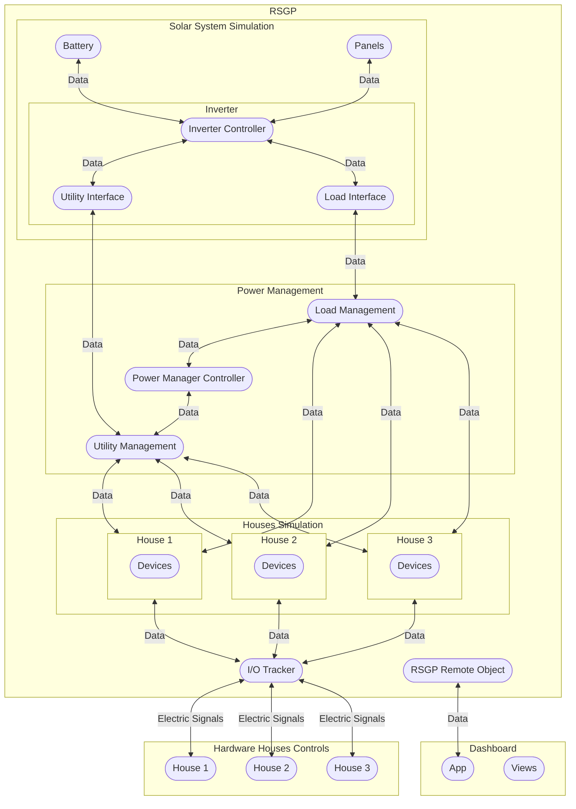

# Residential Smart Grid Project (RSGP)

A comprehensive simulation system for modeling and managing energy distribution in residential smart grid environments. This project simulates the complex interactions between solar power generation, residential energy consumption, battery storage, and intelligent grid management.

## 🌟 Features

### Core Simulation Components

-   **Time Simulation Engine** - Real-time simulation with configurable time acceleration
-   **Solar System Modeling** - Realistic PV panels, battery storage, and inverter simulation
-   **Houses Simulation** - Device-level energy consumption modeling for multiple houses
-   **Intelligent Power Management** - Priority-based energy distribution and load balancing
-   **Remote Control Interface** - Distributed system control via Pyro5

### Key Capabilities

-   Multi-threaded concurrent simulation architecture
-   Real weather data integration (NSRDB)
-   Advanced inverter modeling with multiple operating modes
-   Dynamic load shedding and utility line management
-   Comprehensive logging and data export
-   Real-time dashboard for monitoring and control

## 🏗️ Architecture

The system consists of multiple simulation components running concurrently with a sophisticated power management system.

### System Overview


### Detailed Architecture



## 🚀 Quick Start

### Prerequisites

-   Python 3.8+
-   pip package manager

### Installation

1. **Clone the repository**

    ```bash
    git clone <repository-url>
    cd residential-smart-grid
    ```

2. **Install dependencies**

    ```bash
    pip install -r requirements.txt
    ```

3. **Run the simulation**

    ```bash
    python -m rsgp
    ```

4. **Launch the dashboard** (in a separate terminal)
    ```bash
    python -m dashboard
    ```

### First Run

1. Start the RSGP simulation - this will begin all simulation components
2. Launch the dashboard to monitor and control the system
3. Use the dashboard to view real-time energy flows and system status
4. Check the `rsgp/_logs/` directory for simulation data

## 📖 Usage

### Running Simulations

**Start the main simulation:**

```bash
python -m rsgp
```

**Launch the monitoring dashboard:**

```bash
python -m dashboard
```

**Stop simulation:**
Use `Ctrl+C` to gracefully shutdown all simulation components.

### Configuration

Modify simulation parameters in `rsgp/config/settings.py`:

```python
# Solar System Configuration
BATTERY_CAPACITY = 100_000  # Wh
PANELS_NUM = 80
PANEL_EFFICIENCY = 0.15

# Houses Configuration
HOUSES_NUM = 12

# Time Simulation
TIME_FACTOR = 3600  # 1 hour simulation = 1 second real time
```

### Data Analysis

Explore the Jupyter notebooks in `notebooks/` for:

-   Solar irradiance visualization
-   System performance analysis
-   Energy flow patterns
-   Inverter data analysis

## 📊 System Specifications

### Solar System

-   **Solar Panels**: 80 panels × 1.6m² × 15% efficiency
-   **Battery Storage**: 100 kWh capacity with 95% efficiency
-   **Inverter**: 15kW AC rating with multiple operating modes
-   **Weather Data**: NSRDB integration for realistic solar irradiance

### Residential Loads

-   **Houses**: 12 residential units
-   **Load Modeling**: Device-level ADSR envelope patterns
-   **Power Control**: Individual load line and utility line management
-   **Load Range**: Dynamic consumption based on time-of-day patterns

### Power Management

-   **Priority System**: Solar → Utility → Battery → Load Shedding
-   **Virtual Batteries**: Fair energy allocation per house
-   **Load Balancing**: Real-time distribution optimization
-   **Grid Interface**: Utility connection status management

## 🔧 Development

### Project Structure

```
residential-smart-grid/
├── rsgp/                      # Main simulation package
│   ├── solar_system_sim/     # Solar PV system modeling
│   ├── houses_sim/     # Residential load simulation
│   ├── power_mng/           # Power management algorithms
│   ├── remote_object/       # Pyro5 remote interface
│   ├── config/              # Configuration settings
│   └── utils/               # Utilities and helpers
├── dashboard/                # GUI monitoring interface
├── docs/                    # Sphinx documentation
├── notebooks/               # Analysis notebooks
└── requirements.txt         # Python dependencies
```

### Key Dependencies

-   **pvlib**: Solar irradiance and PV modeling
-   **Pyro5**: Distributed object communication
-   **numpy/pandas**: Scientific computing
-   **tkinter/ttkbootstrap**: GUI framework
-   **sphinx**: Documentation generation

## 📚 Documentation

Comprehensive documentation is available in the `docs/` directory:

-   **Build HTML docs**: `make --directory=docs html`
-   **View docs**: Open `docs/_build/html/index.html`

Documentation covers:

-   System architecture and design
-   API reference
-   Configuration options
-   Advanced usage examples

## 📈 Monitoring & Logging

### Real-time Dashboard

The dashboard provides:

-   System status overview
-   Energy flow visualization
-   House-level load monitoring
-   Solar generation tracking
-   Battery status and management

### Data Logging

-   **Text Logs**: `rsgp/_logs/rsgp.log`
-   **CSV Data**: Timestamped simulation data in `rsgp/_logs/rsgp_YYYY-MM-DD_HH-MM/`
-   **Configurable**: Enable/disable logging in settings

### Performance Metrics

Monitor key performance indicators:

-   Energy self-sufficiency ratio
-   Battery utilization efficiency
-   Load balancing effectiveness
-   System stability metrics

## 🤝 Use Cases

### Research & Education

-   Smart grid behavior analysis
-   Renewable energy integration studies
-   Load balancing algorithm development
-   Grid stability research

### System Design

-   Residential microgrid sizing
-   Battery storage optimization
-   Energy management strategy evaluation
-   Grid integration planning

### Algorithm Development

-   Power management algorithms
-   Energy trading strategies
-   Demand response systems
-   Grid optimization algorithms

## 🙏 Acknowledgments

-   NSRDB for solar irradiance data
-   PVLib community for solar modeling tools

---

**Note**: This simulation is designed for research and educational purposes. For production deployments, additional safety and reliability measures should be implemented.
