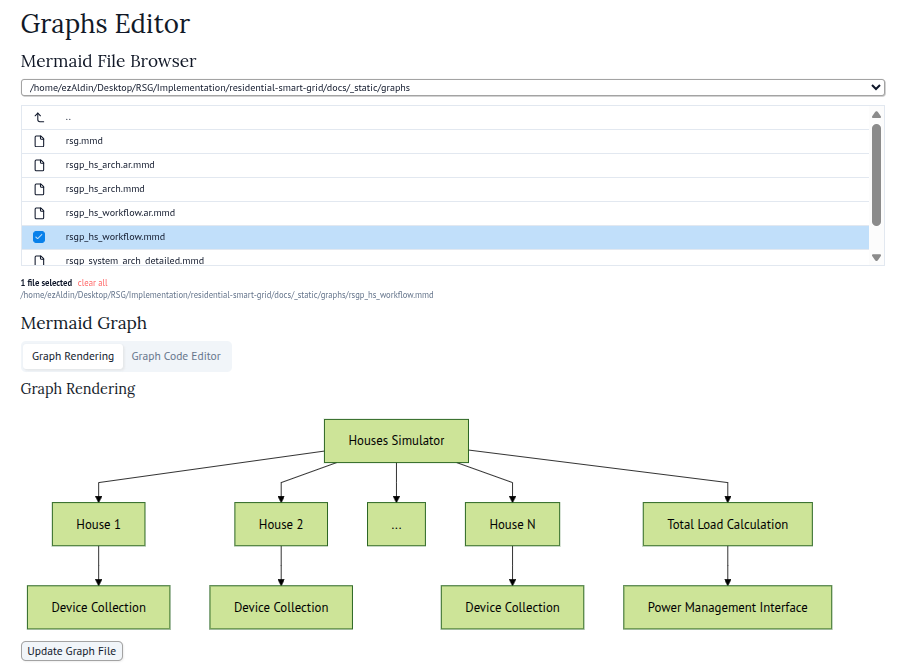

Notebooks Workflow
==================

Introduction
------------
The notebook ecosystem within the residential smart grid project provides comprehensive data analysis and visualization capabilities through a collection of reactive marimo-based applications. These notebooks serve as interactive tools for exploring system performance, examining experimental data, and creating visual documentation elements that support both development and research activities.

The notebooks fulfill multiple roles within the project workflow; they function as data exploration environments, visualization generators, and collaborative analysis tools. Each notebook targets specific aspects of the system data, ranging from external weather datasets to internal simulation outputs and hardware monitoring logs. This modular approach ensures that researchers and developers can examine different system components independently while maintaining the ability to correlate findings across multiple data sources.

The integration of marimo as the notebook framework brings reactive programming capabilities to the analysis workflow. This choice provides automatic dependency tracking, reproducible execution environments, and seamless deployment as interactive web applications. The reactive nature eliminates the hidden state problems commonly encountered in traditional notebook environments and ensures that analysis results remain consistent and reliable.

marimo Framework Overview
--------------------------
The notebooks employ marimo, a next-generation Python notebook framework that transforms traditional notebook limitations through reactive programming principles. marimo stores notebooks as pure Python files rather than JSON structures, enabling proper version control integration and collaborative development workflows. The framework automatically manages cell dependencies; when variables change in one cell, all dependent cells execute automatically to maintain consistency.

.. note:: The choice of marimo over traditional Jupyter notebooks addresses reproducibility concerns while providing enhanced collaboration capabilities through Git-friendly storage formats.

The reactive execution model ensures that notebook state remains synchronized with code changes. This eliminates the common problem of stale outputs that occur when cells execute out of order in traditional notebook environments. Additionally, marimo provides built-in support for modern Python tooling, including code formatting, AI-powered assistance, and interactive user interface components that enhance the analysis experience.

The framework supports deployment of notebooks as standalone web applications, enabling researchers to share interactive analysis tools without requiring recipient systems to install development environments. This capability proves particularly valuable for demonstrating system behavior to stakeholders who may not possess technical backgrounds.

Notebook Applications
---------------------
The project includes four specialized notebook applications, each addressing distinct analysis requirements within the residential smart grid ecosystem. These applications provide targeted functionality for different data sources and analysis objectives.

Graph Editor
~~~~~~~~~~~~
The graph editor notebook (`graphs_editor.py`) provides an interactive environment for creating and modifying Mermaid diagrams used throughout the project documentation. This application bridges the gap between technical documentation requirements and visual design workflows.

   Graph editor interface showing file browser, code editor, and live preview

The application implements a three-panel interface that combines file management, code editing, and live preview capabilities. The file browser restricts navigation to the documentation graphics directory (`docs/_static/graphs/`) and filters for Mermaid files, ensuring that users work within the appropriate project structure. The code editor provides syntax highlighting specifically for Mermaid diagram syntax, reducing errors and improving productivity.

The live preview functionality renders Mermaid diagrams immediately as code changes occur, providing instant visual feedback during the design process. This reactive behavior eliminates the traditional edit-compile-view cycle commonly associated with diagram creation. The application also includes file persistence capabilities, allowing users to save modifications directly to the project documentation structure.

.. warning:: The graph editor modifies files within the documentation structure. Users should ensure proper backup procedures and coordinate with other team members to avoid conflicting modifications.

NSRDB Visualization
~~~~~~~~~~~~~~~~~~~
The NSRDB visualization notebook (`nsrdb_visualization.py`) provides comprehensive analysis capabilities for National Solar Radiation Database weather data. This application enables researchers to examine solar irradiance patterns, atmospheric conditions, and seasonal variations that affect photovoltaic system performance.

.. mermaid::
   :caption: NSRDB data processing and visualization workflow
   :align: center

   graph LR
       A[NSRDB CSV Files] --> B[Metadata Extraction]
       A --> C[Time Series Data Processing]
       B --> D[Timezone Conversion]
       C --> D
       D --> E[Day/Night Classification]
       E --> F[Interactive Field Selection]
       F --> G[Multi-Panel Visualization]
       G --> H[Time Series Chart]
       G --> I[Day/Night Timeline]

The application processes CSV files containing hourly solar radiation measurements from the Phoenix, Arizona region. Data processing includes timezone conversion from UTC to local time using metadata embedded within the NSRDB files. The system automatically extracts timezone offset information and applies appropriate corrections to ensure accurate temporal alignment with simulation data.

The visualization interface provides interactive field selection capabilities, allowing users to examine different atmospheric parameters including Direct Normal Irradiance (DNI), Diffuse Horizontal Irradiance (DHI), Global Horizontal Irradiance (GHI), temperature, and wind conditions. The chart rendering employs a dual-panel approach; the primary panel displays time-series data for the selected parameter, while the secondary panel provides a day-night classification timeline that helps correlate solar generation potential with time periods.

Data exploration features include zoom capabilities, tooltip information display, and configurable time window selection. Users can focus on specific time periods ranging from daily patterns to seasonal trends, supporting both short-term operational analysis and long-term planning activities.

Inverter Logs Visualization
~~~~~~~~~~~~~~~~~~~~~~~~~~~
The inverter logs visualization notebook (`inverter_logs_visualization.py`) processes and displays operational data from physical inverter hardware deployed within the system. This application bridges the gap between simulation results and real-world hardware performance, enabling validation of theoretical models against actual device behavior.

The application reads Excel files containing inverter telemetry data captured through the WatchPower monitoring system. Data fields include power generation levels, battery charge status, load consumption measurements, and operational mode indicators. The time-series processing converts raw timestamps into pandas datetime objects, enabling sophisticated temporal analysis capabilities.

.. note:: The inverter data represents actual hardware measurements rather than simulation outputs, providing ground truth for model validation and system performance assessment.

The visualization interface mirrors the NSRDB application structure while adapting to inverter-specific data characteristics. Users can select from available telemetry fields to examine different aspects of inverter operation. The dual-panel chart configuration displays the selected parameter over time in the primary panel, while the secondary panel shows device operational mode transitions as color-coded timeline indicators.

The application supports analysis of inverter efficiency, load-following behavior, and mode-switching patterns. This information proves essential for understanding how physical hardware responds to varying load conditions and optimizing control algorithms implemented within the simulation environment.

RSGP Logs Visualization
~~~~~~~~~~~~~~~~~~~~~~~
The RSGP logs visualization notebook (`rsgp_logs_visualization.py`) provides analysis capabilities for simulation output data generated by the residential smart grid platform. This application enables researchers to examine system-wide behavior, validate power management algorithms, and identify performance optimization opportunities.

The application processes CSV files containing time-series data from simulation runs, including house-level load profiles, solar generation patterns, battery charge cycles, and power management decisions. The data processing pipeline converts timestamps to proper datetime objects and provides field selection capabilities for examining different system metrics.

.. mermaid::
   :caption: RSGP simulation data analysis workflow
   :align: center

   graph TD
       A[Simulation CSV Logs] --> B[Timestamp Conversion]
       B --> C[Field Extraction]
       C --> D[Interactive Visualization]
       D --> E[System Performance Analysis]
       E --> F[Load Profile Examination]
       E --> G[Power Management Validation]
       E --> H[Battery Cycle Analysis]

The visualization capabilities focus on system-level metrics that indicate power management effectiveness. Key parameters include total system load, renewable energy utilization ratios, grid import-export balances, and battery state-of-charge patterns. The analysis interface supports examination of these metrics across different temporal scales, from minute-by-minute operational behavior to long-term performance trends.

The application provides essential feedback for power management algorithm development; researchers can examine how control decisions affect system stability, efficiency, and grid interaction patterns. This analysis capability directly supports the iterative refinement of power management strategies and validation of simulation accuracy.

Data Integration and Workflow
------------------------------
The notebook applications work together to provide comprehensive system analysis capabilities that span from external environmental conditions through simulation results to actual hardware performance. This integrated approach enables correlation analysis across multiple data sources and validation of simulation accuracy against real-world measurements.

The workflow typically begins with NSRDB data analysis to understand environmental conditions during specific time periods. Researchers then examine simulation results using the RSGP logs visualization to understand how the system responds to those conditions. Finally, inverter logs provide validation data to confirm that physical hardware behavior aligns with simulation predictions.

.. tip:: The reactive nature of marimo notebooks enables researchers to modify analysis parameters in one notebook and immediately observe corresponding changes in dependent visualizations, supporting iterative hypothesis testing and parameter optimization.

The graph editor supports this analytical workflow by providing tools for creating visual documentation that communicates findings to broader audiences. Diagrams created through the graph editor integrate directly into project documentation, ensuring that visual representations remain synchronized with analytical discoveries.

Deployment and Collaboration
-----------------------------
The marimo framework enables deployment of notebooks as interactive web applications, supporting collaboration scenarios where team members require access to analysis tools without installing complete development environments. This capability proves particularly valuable for sharing results with stakeholders who need to examine system behavior but may not possess technical expertise required for traditional analysis tools.

The pure Python storage format facilitates version control integration and collaborative development. Multiple researchers can work on different aspects of the analysis simultaneously while maintaining proper merge capabilities through standard Git workflows. Changes to analysis code generate meaningful diffs that enable code review processes and collaborative improvement of analysis methodologies.

.. warning:: When deploying notebooks as web applications, ensure that data access permissions align with project security requirements. Sensitive operational data should remain within controlled environments.

The notebook applications support export capabilities for generating static visualizations suitable for inclusion in reports, presentations, and publications. This export functionality ensures that analytical discoveries can be communicated through traditional documentation channels while maintaining access to interactive analysis capabilities during development phases.

Development Guidelines
----------------------
Notebook development within the project follows established patterns that ensure consistency, maintainability, and collaborative effectiveness. These guidelines address both technical implementation details and workflow integration requirements.

Code organization within notebooks prioritizes modularity and reusability. Data processing functions implement clear separation between data loading, transformation, and visualization responsibilities. This separation enables testing of individual components and reuse of processing logic across multiple notebooks.

User interface design emphasizes clarity and accessibility. Interactive controls provide meaningful labels and appropriate default values that guide users toward productive analysis workflows. Error handling includes informative messages that help users understand data requirements and troubleshoot common issues.

Documentation within notebooks includes both inline comments and markdown cells that explain analytical approaches, data interpretation guidelines, and known limitations. This documentation ensures that other researchers can understand and extend analysis capabilities without requiring extensive consultation with original developers.

.. note:: The reactive execution model of marimo requires careful consideration of computational dependencies. Expensive operations should be structured to minimize unnecessary recalculation while maintaining result accuracy.

Performance considerations include efficient data loading strategies, appropriate use of caching for expensive computations, and responsive user interface design that provides feedback during long-running operations. These considerations ensure that notebooks remain usable as data volumes increase and analysis complexity grows.

Future Enhancements
-------------------
The notebook ecosystem provides a foundation for expanding analytical capabilities as project requirements evolve. Planned enhancements include integration with advanced machine learning frameworks for predictive analysis, automated report generation capabilities, and enhanced collaboration features for distributed research teams.

Machine learning integration would enable development of predictive models for solar generation forecasting, load pattern recognition, and optimal power management strategy selection. The reactive notebook environment provides an ideal platform for iterative model development and parameter tuning workflows.

Automated reporting capabilities would generate periodic system performance summaries based on ongoing simulation results and hardware measurements. These reports would integrate visualizations created through the notebook applications and provide standardized documentation for stakeholder communication.

Enhanced collaboration features include real-time notebook sharing, integrated communication tools, and automated notification systems for significant analytical discoveries. These features would support distributed research teams and enable more effective coordination of analytical activities across multiple project participants.
