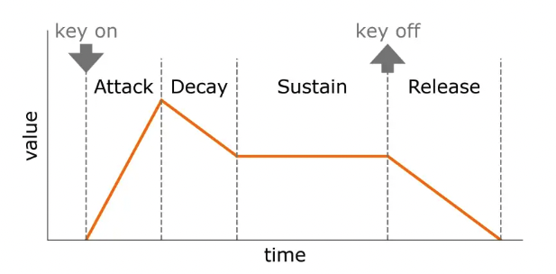

RSGP Houses Simulation
======================
Introduction
------------
The houses simulation serves as the primary load generator within the system. This chapter examines the implementation of the residential home model, the device modeling framework, and the coordination mechanisms between the components of the house simulation. 

The significance of the houses simulation extends beyond simple load modeling. It provides the testing environment to evaluate power management algorithms under varying consumption scenarios. The simulation tracks **N** houses implementing the same model. Each house contains multiple devices with different consumption patterns. This aims to mirror real world residential demand.

Architecture Overview
---------------------
The architecture separates simulation coordination, individual house modeling, and device-level power consumption calculations. 

.. mermaid:: ../_static/graphs/rsgp_hs_arch.mmd
   :align: center
   :caption: Houses simulation architecture with hierarchical device organization

- The ``HousesSimulator`` serves as the coordination layer; it manages the house instances and coordinates their execution. 
- The ``House`` serves as the individual unit; it maintains state information about its devices and utility and load lines. 
- The ``DeviceClass`` serves as the base for the loads; it does the calculations per each device's parameters to simulate realistic load consumption patterns. 

.. note:: The design prioritizes modularity and allows for dynamic addition of new device types without modification to the core simulation. This makes it easier to craft testing scenarios.

The Houses Simulator
--------------------
The ``HousesSimulator`` coordinates the execution of individual house instances; it aggregates system-wide load calculations and provides the interface between the residential demand and the power management system. The simulator operates on its own thread to ensure that house load calculations proceed independently of the other components.

.. mermaid:: ../_static/graphs/rsgp_hs_workflow.mmd
   :align: center
   :caption: HousesSimulator coordination and load aggregation workflow

The simulator implements a configurable update cycle usually set to 100-millisecond intervals. During each update cycle, the simulator queries all house instances for their current power consumption and aggregates these values. The system-wide total load is then made available to the power management system. 

.. warning:: Load line disconnection affects only the connectivity between houses and the power providers; internal house simulations continue to maintain realistic behavior on reconnection.

Individual House Modeling
-------------------------
The ``House`` model maintains state information about connectivity and devices.Multiple device instances coexist and contribute to the overall house load. Each house contains a predefined set of device types, which include heating and cooling systems, lighting, major appliances, and miscellaneous electrical loads. 

The model aggregates individual device loads and tracks its energy exchange with the utility. This supports both scenarios where the house exports excess renewable energy or imports power when that renewable energy is insufficient. 

Device Modeling Framework
-------------------------
The ``Device`` modeling framework implements a mathematical model that captures the dynamic behavior of residential electrical appliances. This framework borrows the **Attack-Decay-Sustain-Release envelope (ADSR)** from sound synthesis and uses it along wave modulation techniques to approximate the load profiles. These techniques generate realistic power consumption patterns that mimic real electrical devices.

   ADSR envelope

The **ADSR envelope** provides the temporal structure for the device's power consumption. It models the startup spike, steady-state operation, and shutdown characteristics of the device. 

- The **Attack** phase models the initial power spike that occurs when the device activates. This typically involves inrush currents for motor-driven appliances or heating element activation for thermal devices. 
- The **Decay** phase models the transition from that startup spike to normal operation as the device's components stabilize. 
- The **Sustain** phase models the steady-state operation where the device maintains its power consumption level. This phase also uses wave modulation to model load variations due to changing conditions. 
- The **Release** phase models the shutdown. This includes braking effects in motor systems and thermal cool-down periods that continue to consume power for a short while until complete shutdown.

Wave modulation introduces realistic variations in power consumption over the ADSR envelope. The framework supports multiple modulation types: sine waves, square waves, and random modulation. These modulation patterns operate at different frequencies and amplitudes to create complex power signatures that more closely match measured residential devices' behavior.

.. .. plot::

..    Some plot for real device load over time

The device modeling framework organizes electrical devices into categories. Each category implements specialized ADSR parameters and wave modulation to capture the unique behavior of the device.

Integration with Power Management
---------------------------------
The ``HousesSimulator`` provides the aggregated system load to the ``PowerManager``, along the specific load for each house in the simulation. The ``PowerManager`` then does its calculation and may communicate back to the simulation, connecting or disconnecting some of the houses' load or utility lines. The ``HouseSimulator`` thus offers an interface for the ``PowerManager`` to read the data it needs and modify the simulation per its judgment. 

.. note:: The interface maintains loose coupling between the ``HouseSimulator`` and the ``PowerManager`` to enable independent development and testing.

Data Collection and Analysis
-----------------------------
The houses simulation captures device operation statistics and system performance metrics for later analysis. The data is stored as a time-series dataset (in a CSV file) to enable examination of the effectiveness of power management solutions.

CSV logging operates in the update cycle (usually once every 100-milliseconds). It records total house loads, individual device loads, connectivity states, and utility exchange values for each house throughout the simulation. The goal is to track the utility exchange power and minimize it through an effective power management solution.
