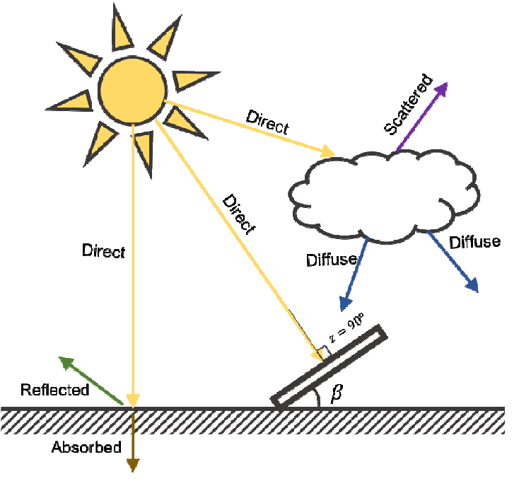
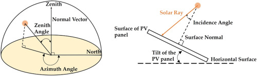
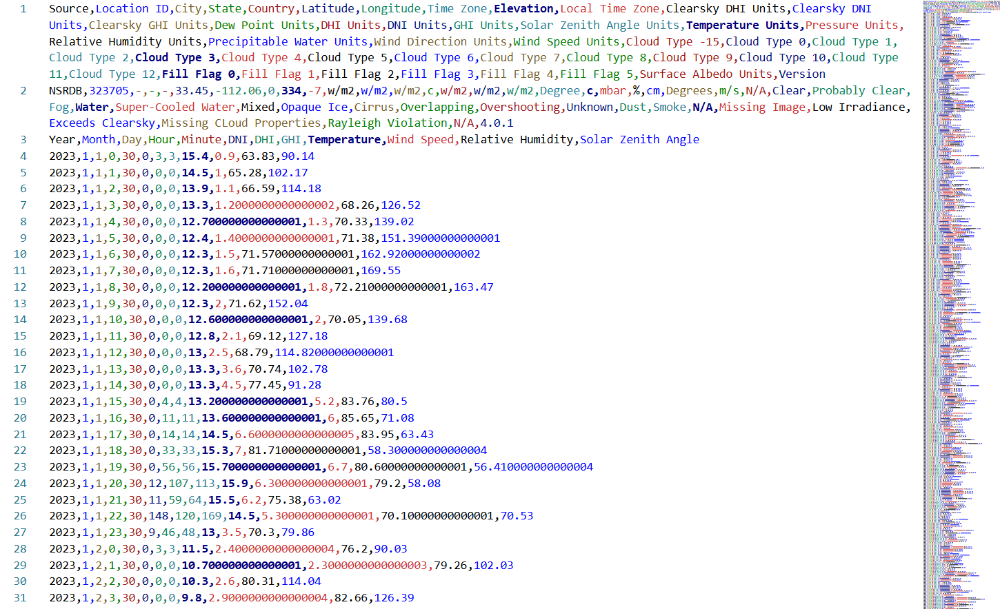

Solar System Simulation
=======================
Introduction
------------
The solar system simulation serves as the source of power within the system. This chapter examines the implementation of photovoltaic panel modeling, battery energy storage systems, and inverter control mechanisms that enable realistic solar power generation and management.

While the houses simulation models energy consumption, the solar system simulation models energy production and storage. Together they form the fundamental supply-demand dynamic that defines smart grids. The power management system, discussed in later chapters, coordinates between these two to optimize energy usage.

Solar System Architecture Overview
----------------------------------
The solar system simulation architecture consists of photovoltaic panels, one battery, and an inverter connecting the elements. The inverter is then connected to the power manager through a load line and a utility line. This design separates concerns between energy generation, storage, and power conversion and enables more realistic modeling of each component.

.. mermaid:: ../_static/graphs/C4_sss_arch.mmd
   :align: center
   :caption: Solar system simulation architecture

The **Panels** handle solar irradiance calculations and power generation based on the data collected from the National Solar Radiation Database (NSRDB). The **Battery** manages charge state tracking. The **Inverter** adheres to its operational mode control and manages power distribution from and to the solar system components and the demands of the power manager.

.. note:: The three-component architecture enables independent development and testing of solar generation, energy storage, and power distribution.

Photovoltaic Panel Modeling
---------------------------
The photovoltaic panels integrate with the National Solar Radiation Database to obtain weather information and employs the PVLib photovoltaic modeling library to perform accurate solar calculations. The panel model accounts for solar position, atmospheric conditions, and system configuration parameters to generate power output that mirror actual photovoltaic system performance.

.. mermaid:: ../_static/graphs/C4_sss_workflow.mmd
   :align: center
   :caption: Photovoltaic panel modeling workflow and data processing pipeline

The NSRDB contains hourly solar irradiance measurements, temperature data, and atmospheric conditions for locations across the United States. In the simulation, only data local to Phoenix/Arizona was used. The simulation system processes this data to extract direct normal irradiance (DNI), diffuse horizontal irradiance (DHI), and global horizontal irradiance (GHI) values necessary for photovoltaic calculations. The database integration includes automatic timestamp conversion, timezone handling, and data interpolation to support accelerated simulation time.

Solar position calculations account for latitude, longitude, time of year, and time of day to determine solar azimuth and elevation angles. The solar position information combines with irradiance data (DNI, DHI, and GHI) to calculate the effective solar energy. The PVLib library performs these calculations using established solar position algorithms. Below is an overview of the parameters of that calculation.

   Components of solar radiation (Source: ResearchGate)

- **Direct Normal Irradiance (DNI)** represents the irradiance directly from the sun to the surface of the photovoltaic panels.

- **Diffuse Horizontal Irradiance(DHI)** represents the irradiance indirectly reaching the surface of the photovoltaic panels through the rays scattered by the sky dome.

- **Global Horizontal Irradiance(GHI)** represents the total irradiance, calculated by the following formula:

.. math::

   GHI = DNI \times \cos(\theta) + DHI

where :math:`\theta` is the solar zenith angle. 

.. plot:: _static/plots/C4_solar_irradiance_daily_cycle.py
   :align: center

   Solar irradiance components over a typical clear day showing DNI, DHI, and GHI variations with solar zenith angle

   Solar zenith angle (Source: ScienceDirect Topics)

The simulation supports configurable panel count, individual panel area, and conversion efficiency specifications that determine total array capacity. The total photovoltaic power generation follows:

.. math::

   P_{total} = POA_{irradiance} \times A_{panel} \times \eta_{panel} \times N_{panels}

where :math:`POA_{irradiance}` represents plane-of-array irradiance, :math:`A_{panel}` represents individual panel area, :math:`\eta_{panel}` represents panel efficiency, and :math:`N_{panels}` represents the number of panels.

Battery Energy Storage System
-----------------------------
The battery system implement lithium-ion battery characteristics including charge acceptance, storage capacity, and charge efficiency. The model provides an interface to the inverter to charge and discharge from the battery as per its calculations. As such, the battery component itself is devoid of any calculations beside implementing its charge efficiency and limitations.

The battery charge operation follows:

.. math::

   P_{charge,actual} = \min(P_{charge,requested}, P_{max,charge}) \times \eta_{charge}

.. math::

   E_{charge} = P_{charge,actual} \times \Delta t

.. math::

   SoC_{new} = \min(SoC_{current} + E_{charge}, C_{total})

where :math:`\eta_{charge}` represents charging efficiency, :math:`\Delta t` time interval in hours (:math:`\Delta t = \frac{\Delta t_{s}}{3600}` where :math:`\Delta t_{s}` is the interval in seconds), and :math:`SoC` state-of-charge.

The battery can also be configured on the maximum charge current it can accept, and the maximum discharge. This models the safety considerations present in actual batteries as they reject currents above a certain level. The discharge operation implements:

.. math::

   P_{discharge,actual} = \min(P_{discharge,requested}, P_{max,discharge}) / \eta_{charge}

.. math::

   E_{discharge} = \min(P_{discharge,actual} \times \Delta t, SoC_{current})

.. math::

   SoC_{new} = SoC_{current} - E_{discharge} 

Inverter Control System
-----------------------
The inverter manages power flow between the photovoltaic panels, battery, and the power manager. It implements DC to AC conversion modeling to account for power losses that occur when converting direct current from the photovoltaic panels and the battery to alternating current for load consumption and utility export. The conversion is handled by the PVWatts library that follows established algorithms to accurately model the conversion.

The DC to AC conversion follows the PVWatts model:

.. math::

   P_{ac} = \min\left(\eta_{inv} \times P_{dc} \times \left(1 - \frac{P_{dc}}{P_{dc0}}\right), P_{ac0}\right)

where :math:`\eta_{inv}` represents inverter efficiency, :math:`P_{dc0}` represents DC power rating, and :math:`P_{ac0}` represents AC power rating. The reverse calculation for required DC power uses:

.. math::

   P_{dc,required} = \frac{P_{ac,target}}{\eta_{inv,overall}}

.. plot:: _static/plots/C4_dc_ac_conversion_efficiency.py
   :align: center

   DC-to-AC conversion characteristics showing PVWatts model efficiency curve compared to ideal linear conversion

The inverter implements three operating modes for power flow priority.

- **Solar-Battery-Utility (SBU) mode** prioritizes using the power available from the photovoltaic panels if present, and only when the panels by themselves do not meet the load that it draws from the battery. When the battery is empty, only then would the inverter draw from utility. This mode aims to reduce grid-dependency to a minimum.

- **Solar-Utility-Battery (SUB) mode** prioritizes using the power available from the photovoltaic panels--just like the previous mode. However, when the panels power prove insufficient, it draws from utility to meet the demand and keeps the battery as only a last resort when no other source of energy exists. This mode aims to provide security and prepare to meet emergencies.

- **Utility-Solar-Battery (USB) mode** prioritizes drawing from utility. It uses the solar system as only a back-up in case the utility is out of service.

.. note:: The power manager can switch the operation mode of the inverter. This may prove useful in scenarios where the battery should be reserved for a foreseen emergency, thus switching the operation mode to SUB to use the utility now and keep the battery to be used when neither the solar panels nor the utility can provide power. While the capability for this currently exists in the system, the power manager carries out no such switches as it currently lacks the ability to predict emergencies.

Additionally, the inverter implements a charge priority, which determines how excess solar power gets allocated between battery charging and utility export. The system supports multiple charge priority settings including solar-only charging, solar-first charging, and utility-assisted charging modes.

- **Solar-only** directs all excess solar power to battery charging before any utility export occurs.

- **Solar-first** uses the excess solar power to charge the battery when present. When not present, it uses the utility to charge the battery.

- **Utility-assisted** enables battery charging from utility power even when some excess solar power is present.

In all charge priorities, the inverter will export to utility only when the battery is full. The power flow priority algorithms implement sequential decision trees:

.. math::

   P_{remaining} = P_{load} - \sum_{source} P_{source,allocated}

where power sources are allocated according to the configured priority mode, and any remaining unmet load triggers load line disconnection.

.. mermaid:: ../_static/graphs/C4_inverter_operational_modes.mmd
   :align: center
   :caption: Inverter operational modes showing power flow priority and decision trees for SBU, SUB, and USB modes

The inverter implements load shedding as a protective measure that prevents system overload. It disconnects the load when available power sources prove insufficient. The load is then automatically reconnected after a set period of time, during which the power manager should have taken care of the issue.

.. note:: The power manager ensures that load shedding may not happen as it automatically disconnects loads from the specific houses that are overusing. As such, load shedding is only ever triggered in the extreme situations where the power manager fails.

Weather Data Integration
------------------------
This component manages the interface between the simulation environment and the external weather database, ensuring that solar calculations reflect actual atmospheric conditions.

The National Solar Radiation Database is the primary data source for solar irradiance and atmospheric conditions. The NSRDB provides hourly measurements of solar radiation components (DNI, DHI, and GHI), ambient temperature, wind speed, and other meteorological parameters collected at numerous locations across the United States. This database is one of the most comprehensive sources of solar data available for renewable energy applications, providing the data necessary for detailed photovoltaic system modeling.

The dataset used from NSRDB covers the aforementioned measurements taken in the Phoenix/Arizona for one full year; one record each half an hour. Data is extracted using the simulation time; the record with the timestamp closest to the current simulation timestamp is used for the calculations of the solar energy in that specific moment in the simulation.

   Snapshot of the NSRDB dataset used

Power Management Interface
--------------------------
The solar system takes in the load from the power manager and gives back the solar panel power used, battery discharged, and grid import or export. The power manager then uses these data to take decisions regarding the load. The interface is two-way; the power manager provides the load, and the solar system provides metrics specifying how the load is being met.

Currently, the interface consists purely of the exchange of data; there is no exchange of commands or requests between the components.

Data Collection
---------------
Data collection operates continuously throughout simulation to capture time-series data about solar generation, battery operation, and system-wide energy flows. The collected data can then be analyzed to pinpoint issues in the model and help refine both the simulation and the power management solutions. Utility import and export represent the most important metrics collected, as they are direct metrics of the effectiveness of the power management solution.

The system captures data from all the components to enable any form of analysis. The data collection is extensive: state-of-charge of the battery, power generated from the panels, the system-wide load, utility import and export, among other metrics. The data is logged to a CSV file continuously throughout the simulation.

.. plot:: _static/plots/C4_solar_system_simulation_visualization.py
   :align: center

   Real-time solar system simulation demonstration showing solar generation, battery operation, system connection states, and utility grid exchange during controlled operational scenarios

Along the data from NSRDB, the logged CSV files provide all the data needed to carry out analysis on the trends of power generation and consumption. Trend analysis might lead to improvements on the power management solutions. Additionally, AI techniques can be used to benefit from the data and extend the power manager with AI capabilities. This could be especially useful to predict shortages of power generation and thus switch the operation mode of the inverter to import from utility to keep the battery for that shortage and thus maintain long-term system stability.
