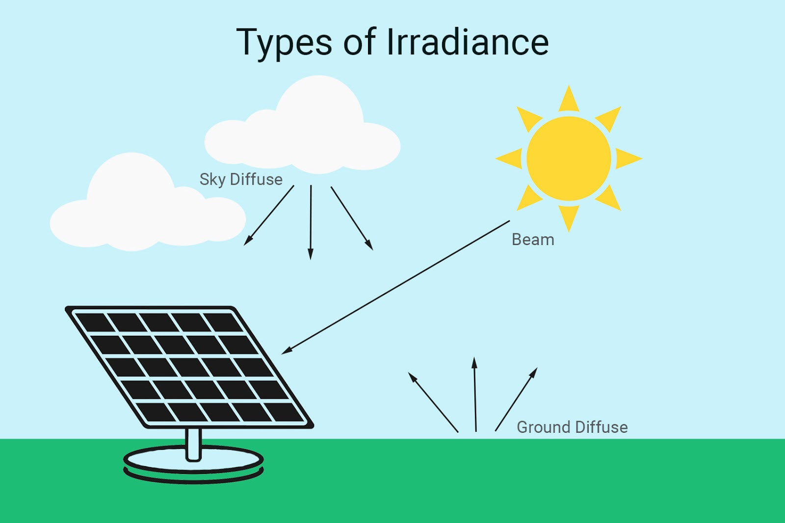
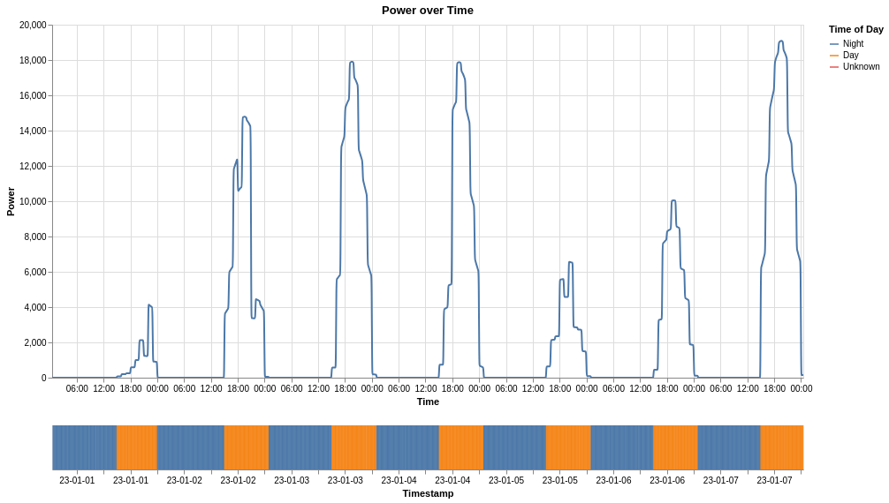

Solar System Simulation
=======================
The mechanism of Solar System Simulation is this: it requests the timestamp from the Time Simulation, then it seeks to the timestamp in the NSRDB dataset that is closest to that timestamp, and it takes the related DNI, DHI, GHI, and Zenith Angle. Then using Pvlib, the solar irradiance is calculated, then the total generated power is calculated based on the settings; the amount of solar panels, their angling, the panels' efficiency, etc. 

.. note:: Optionally, Solar System Simulation logs the total power generated over time into a csv file. The behavior is set in the settings. 

The system models solar radiation through three distinct metrics: Direct Normal Irradiance (DNI) for direct sunlight, Diffuse Horizontal Irradiance (DHI) for scattered radiation, and Global Horizontal Irradiance (GHI) for total radiation. This three-metric approach provides a complete representation of solar availability at the Earth's surface. The separation of direct and diffuse components allows for accurate modeling of different atmospheric conditions, from clear skies to overcast days. The combination of these metrics through the GHI calculation captures the total solar resource available at any given time, forming the foundation for power generation calculations.

   Figure 1: Types of Solar Irradiance - DNI (Direct Normal), DHI (Diffuse Horizontal), and GHI (Global Horizontal) components of solar radiation.

The solar zenith angle governs the effective solar flux, while panel orientation affects energy capture. The system uses a fixed tilt angle of 35 degrees, optimized for average annual performance rather than seasonal extremes. This configuration produces predictable energy patterns with an acceptable margin of error for residential applications. The fixed tilt represents a practical compromise between installation complexity and energy yield. While tracking systems could increase annual energy capture by 20-30%, the additional mechanical complexity and maintenance requirements would outweigh the benefits for residential installations. The chosen angle maximizes winter production while maintaining adequate summer generation, aligning with typical residential load patterns.

.. figure:: ../_static/images/C4_zenith_angle.jpg
   :width: 600
   :align: center
   :alt: Solar Zenith Angle
   :figclass: align-center

   Figure 2: Solar Zenith Angle - The angle between the sun's position and the vertical direction, crucial for calculating effective solar radiation on tilted surfaces.

The battery model accounts for charge/discharge efficiency losses while focusing on system-level energy balance. This approach captures the essential dynamics of energy storage while maintaining computational efficiency, though it omits detailed electrochemical processes. The simplified model accurately represents the fundamental behavior of lithium-ion batteries at the system level: energy storage capacity, charge/discharge rates, and round-trip efficiency. These parameters dominate the system's behavior in residential applications, where the focus is on energy management rather than battery chemistry. The model's abstraction level matches the temporal resolution of solar data and load patterns, ensuring consistent behavior across the simulation's time scales.

Each component - solar array, battery, power management - functions as an independent unit with defined interfaces. This structure enables component-level optimization and replacement while maintaining system integrity. The modular approach introduces abstraction layers that require careful management to preserve system coherence. The separation of concerns allows for independent development and testing of each component, reducing system complexity and improving maintainability. The defined interfaces ensure consistent behavior regardless of internal implementation details, enabling future enhancements without disrupting existing functionality. This architectural pattern proves particularly valuable in simulation systems, where different components may require different levels of detail or computational approaches.

   Figure 3: Solar System Simulation Architecture - Overview of the system components and their interactions, showing the flow of energy from solar radiation to consumption.

The system processes data in discrete time steps, with NSRDB providing hourly resolution. This granularity limits the system's ability to model rapid power fluctuations, though linear interpolation between data points reduces this limitation. The time step selection directly affects both simulation accuracy and computational resource requirements. The hourly resolution aligns with typical residential load patterns and solar radiation changes, where significant variations rarely occur on shorter timescales. The interpolation scheme smooths transitions between data points while preserving the overall energy balance. This approach maintains accuracy for daily and seasonal patterns while keeping computational requirements reasonable for residential-scale simulations.

The system models solar radiation as uniform across the array, disregarding micro-shading and panel-level variations. This simplification is appropriate for residential-scale systems but prevents accurate modeling of localized effects. The uniform radiation assumption holds for typical residential installations where shading effects are minimal and panel-level variations average out across the array. This approach significantly reduces computational complexity while maintaining accuracy for system-level analysis. The simplification becomes less valid for complex roof geometries or heavily shaded installations, but these scenarios represent edge cases in typical residential deployments.

.. graphviz::
   :align: center
   :caption: Energy Flow in Solar System

   digraph energy_flow {
      rankdir=TD;
      node [shape=box, style="rounded,filled", fillcolor="#f0f0f0", fontname="Helvetica"];
      edge [fontname="Helvetica", fontsize=8];
      
      "Solar Radiation" -> "Energy Conversion";
      "Energy Conversion" -> "Storage";
      "Storage" -> "Distribution";
      "Distribution" -> "Consumption";
   }

Power generation follows a 24-hour cycle, with solar and battery power operating in complementary phases. The system maintains energy balance through storage of excess generation and controlled discharge during deficits. This regulation mechanism must accommodate phenomena operating across different time scales, from gradual solar position changes to instantaneous load variations. The daily cycle dominates system behavior, with predictable patterns of generation and consumption. The battery system smooths out short-term mismatches between generation and demand, while the solar array provides the primary energy source during daylight hours. This natural complementarity creates a stable operating regime that requires minimal active control.

Time synchronization enables accelerated simulation of long-term effects, while power management coordinates generation and consumption. The system responds to load variations through predefined control algorithms, establishing feedback mechanisms that affect overall system performance. The accelerated time scale allows for efficient analysis of seasonal patterns and long-term system behavior. The control algorithms implement simple but effective rules for energy management: store excess solar generation, discharge during deficits, and maintain battery state of charge within safe limits. These rules create a robust system that can handle typical residential load patterns without complex optimization algorithms.

The system does not model temperature effects on panel efficiency or weather conditions beyond solar position. These omissions are justified by the system's focus on residential-scale analysis, though they limit the model's applicability to detailed engineering design. Temperature effects typically cause less than 10% variation in panel output, while weather patterns beyond solar position introduce significant complexity for minimal gain in residential applications. The system's focus on energy balance and daily patterns makes these factors secondary considerations. The simplified approach provides sufficient accuracy for system sizing and basic performance analysis, which are the primary concerns in residential solar design.

The battery system implements a simplified energy storage model. The focus on energy balance rather than electrochemical processes enables system-level analysis while maintaining computational efficiency. This approach cannot model complex battery behaviors or long-term degradation effects, which may be significant for extended operational periods. The simplified model captures the essential characteristics of modern lithium-ion batteries: high round-trip efficiency, predictable capacity fade, and well-defined charge/discharge characteristics. These properties dominate system behavior in the 5-10 year timeframe typical for residential system analysis. The model's abstraction level matches the available data and analysis requirements, providing meaningful results without unnecessary complexity.

.. warning::
   While the current model provides valuable insights, it should not be used for detailed engineering design without considering additional factors.

The preserved core behaviors and relationships enable meaningful analysis of residential solar systems, though future enhancements could incorporate more sophisticated modeling approaches for specific applications. The system's focus on fundamental energy flows and daily patterns provides a solid foundation for understanding residential solar system behavior. The abstraction level matches typical design requirements while maintaining computational efficiency, making it suitable for both educational and preliminary design purposes.
