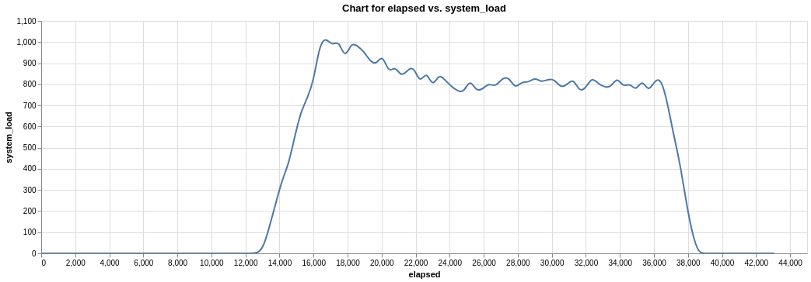

Houses Loads Simulation
=======================

This simulation provides a way to interact with the solar system. It allows the
user to "turn on" simulated devices to see their impact on the system; how they
draw from solar energy or from the battery depending on the situation. As its
sole purpose is to test the solar system simulation and the power management,
it only runs in conjunction with them and never standalone.

The simulation consists of `n` houses, the exact number is defined in the
project settings. Each house connects with power management through a utility
line and a load line. Its load is determined by the devices the house is
running. The device types are shared between houses for simplicity.

.. note::
  The utility line has no functionality. Some plans were made to integrate it
  into the system. The plans were scrapped in favor of narrowing the scope of
  the project.

The main point of this simulation is to mimic the behavior of devices,
otherwise, we might as well have an input field to set the exact number of
watts each house is to use. Devices do not use a static amount of energy.
When they first run, they have a spike in energy, then they decay and sustain
their level until they are released. That is, the behavior of electronic
devices can be modeled as an ADSR envelope.

ADSR stands for Attack, Decay, Sustain, Release. In programming, we have
defined for each type of device its own envelope: how long its Attack, Decay,
and Release times are, and at what percentage of the max does the sustain level
sit; where the max is the level reached by Attack (so for example the Sustain
can be 80% of the Attack level). So, it takes ``A`` seconds to get to the
``base_wattage`` of the device (which is the Attack level), then ``D`` seconds
to reach the ``base_wattage * S``, and once the device is released it takes
``R`` seconds for its usage to reach ``0``.

.. image:: ../_static/images/C5_adsr_envelope.png
  :width: 500
  :align: center
  :alt: ADSR Envelope Demonstration

Additionally, devices do not sustain at a static level; their behavior more
closely resembles a wave. So on top of that, the entire envelope of the device
is multiplied by a wave to simulate that behavior. Alternatively, random noise
can be added atop the envelope.

And lastly, some devices use different amounts of energy based on their mode of
operation, for example a washing machine. To simulate that, the device's mode
of operation can be set in real time and that affects its envelope through a
multiplier that adjusts the device's energy consumption. For example, one mode
sets the Attack level to 90% of the ``base_wattage``, while another sets it to
150%.

To keep track of all of this, the Houses Loads Simulation relies on the Time
Simulation and stores the time each device was turned on. By comparing that
with the current simulation time, it calculates how far into the envelope the
device is and its current load based on that. The house then calculates its
aggregate load, and the simulation the entire system load. This data is sent to
power management, which may trigger breaking a certain house's load line.

.. note::
  Houses Loads Simulation also optionally logs the system load over time into a
  csv file. Whether it logs or not is set in the project settings along the
  number of houses in the simulation.
