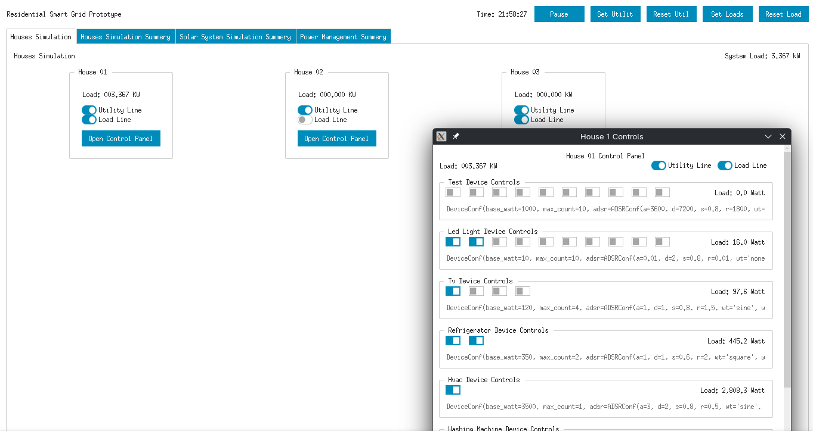

Dashboard
=========
Introduction
------------
The dashboard serves as the human-machine interface for the residential smart grid prototype, providing real-time monitoring and control. This chapter examines the implementation of the graphical user interface and the remote object communication architecture that enable operators to interact with the simulation.

Remote Object Architecture
--------------------------
The dashboard implements a distributed architecture using Pyro5 remote objects to communicate with the simulation components. This design separates the user interface from the computation-intensive simulation processes, enabling the dashboard to run independently while maintaining synchronized access to system state and control functions.

The system uses environment variables to configure connection parameters, allowing deployment flexibility across different network configurations and development environments.

.. note:: The Pyro5 remote object framework provides transparent network communication, enabling the dashboard to treat remote simulation components as local objects while maintaining network resilience and error handling.

Dashboard Application Framework
-------------------------------
The dashboard application builds upon the Tkinter GUI framework enhanced with ttkbootstrap styling to provide a modern, responsive user interface.

   Dashboard snapshot

The application implements a hierarchical view structure that scales to accommodate varying numbers of houses and devices within the simulation. The framework provides scrollable interfaces for scenarios with large numbers of components, ensuring usability regardless of simulation scale.

.. mermaid:: ../_static/diagrams/C6_component_layout.mmd
   :align: center
   :caption: Dashboard component layout showing hierarchical view structure and UI organization

Houses Simulation Interface
---------------------------
The houses simulation interface provides monitoring and control capabilities for individual houses. Each house panel displays current power consumption, connectivity status, and provides access to control the house's load. The utility line and load line toggles enable operators to simulate grid disconnections to support testing of power management response mechanisms.

The house control window provides access to individual device operations within each house. These windows display device-specific information including current load and configuration parameters.

Summary and Monitoring Views
----------------------------
The dashboard implements dedicated summary views for each major simulation component, providing comprehensive real-time status information and operational metrics. These views serve as primary monitoring interfaces for system analysis and troubleshooting activities.

- The houses simulation summary displays system-wide statistics including total load, individual house contributions, and connectivity states. The information updates continuously during simulation execution and provides formatted output that facilitates rapid assessment of system state.

- The solar system simulation summary provides detailed information about photovoltaic generation, battery state, and inverter operations.

- The power management summary displays algorithm performance metrics and decision-making status. This information proves essential for evaluating power management effectiveness and identifying areas for algorithm improvement.

Real-time Update Architecture
-----------------------------
The dashboard implements a real-time update system that maintains synchronization between the user interface and the underlying simulation. The length of the update cycle can be set to balance between maintaining real-time connection and minimizing overhead. As such, the default of 100-milliseconds was chosen as a middle between responsiveness and low overhead.

Data Collection and Analysis Support
------------------------------------
The dashboard provides access to simulation data through its summary views and component monitoring interfaces. This information supports both real-time system analysis and post-simulation evaluation of system performance and algorithm effectiveness.

.. note:: The data is currently displayed only as summaries, lacking any visualization, as the goal of the dashboard was to debug the simulation and power management solutions. However, the data exported to CSV files from the various simulation components can be imported into a third party tool for visualization and statistical analysis.
