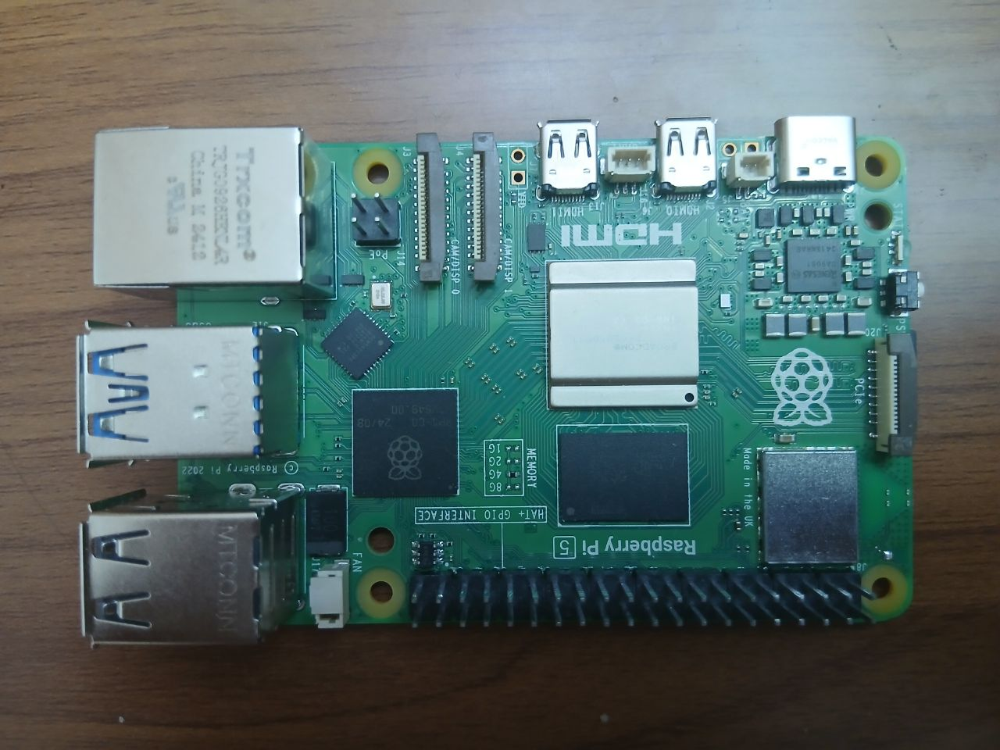
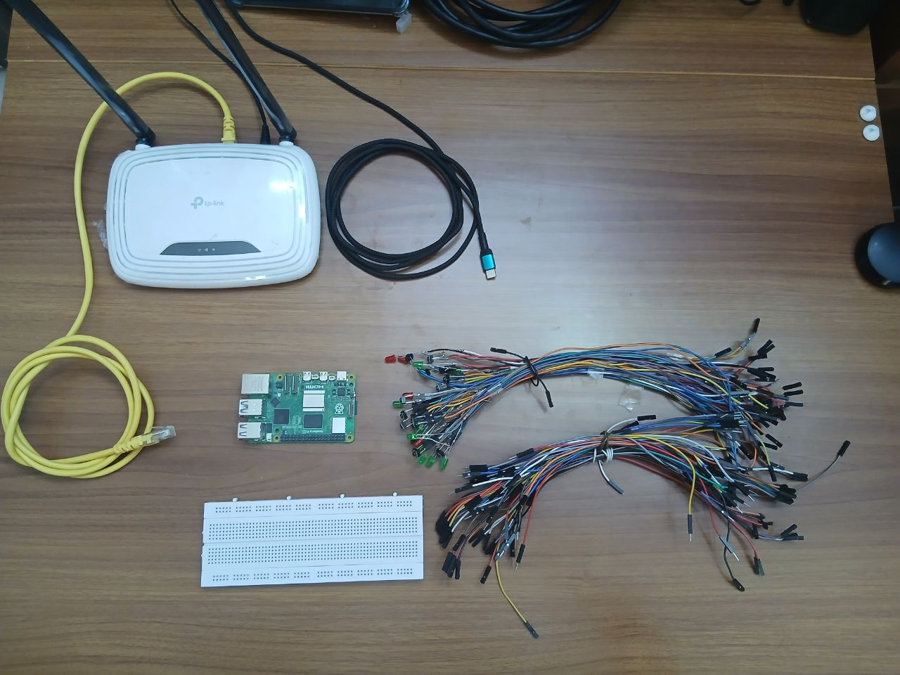
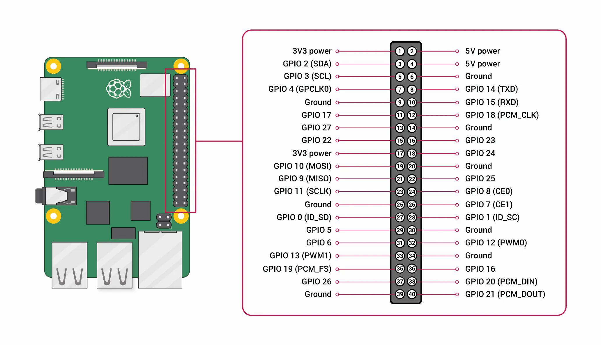

Raspberry Pi Controller
=======================
Introduction
------------
The Raspberry Pi controller serves as the physical hardware interface for the residential smart grid project. This chapter examines the implementation of the GPIO controller system that bridges between the software simulation and physical hardware controls. The controller enables real-time interaction with the RSGP simulation through physical buttons and visual feedback via LEDs; thus providing an intuitive testing environment.

System Architecture Overview
----------------------------
The controller architecture separates hardware abstraction, GPIO management, and simulation integration into distinct layers. This modular design ensures that hardware-specific code remains isolated from simulation logic; thus maintaining system flexibility and enabling future expansion to different hardware platforms.

The architecture implements a three-layer approach: the hardware layer manages physical GPIO operations; the controller layer provides abstraction and mapping logic; and the communication layer enables remote interaction with the RSGP simulation. This separation ensures that each layer operates independently; thus allowing for individual component testing and modification without affecting other system elements.

The architecture is a variation on the popular Model-View-Controller architecture, but the Views are swapped here with a communication system that synchronizes with the simulation, albeit a minimal View represented by the state of the LEDs still remains.

Hardware Configuration and GPIO Mapping
---------------------------------------
The hardware configuration system manages the mapping between physical GPIO pins and logical device controls.

GPIO Pin Allocation Strategy
~~~~~~~~~~~~~~~~~~~~~~~~~~~~
The pin allocation follows a systematic approach that groups related controls and maintains logical separation between houses and device types. The allocation strategy ensures that each house receives dedicated GPIO pins for its device controls; while global controls such as the utility line receive separate pin assignments.

The GPIO mapping employs a paired button-LED configuration where each control function receives both an input button and a corresponding output LED. The button enables user interaction; while the LED provides visual feedback about the current state of the load line of the associated house in the simulation. This pairing ensures that users receive immediate confirmation of their actions and continuous state information.

Mathematical GPIO Pin Assignment
~~~~~~~~~~~~~~~~~~~~~~~~~~~~~~~~
The GPIO pin assignment follows a mathematical pattern that ensures systematic allocation across houses and device types. The button pin allocation for house devices follows:

.. math::

   P_{button,h,d} = (h-1) \times 4 + d + 1

where :math:`h` represents the house number (1-3), :math:`d` represents the device index (0-3), and :math:`P_{button}` represents the GPIO pin assigned to the button.

The LED pin allocation maintains a consistent offset from button pins:

.. math::

   P_{LED,h,d} = P_{button,h,d} + 13

This mathematical relationship ensures predictable pin assignments and simplifies hardware layout planning. The utility line receives dedicated pin assignments outside the house-specific allocation range to prevent conflicts with house-level controls.

GPIOController Implementation
-----------------------------
The ``GPIOController`` serves as the primary interface between the Raspberry Pi hardware and the RSGP simulation system. The controller implements comprehensive GPIO management, including input monitoring, output control, and bidirectional communication with simulation components.

Controller Initialization and Setup
~~~~~~~~~~~~~~~~~~~~~~~~~~~~~~~~~~~
The controller initialization process establishes GPIO chip access; configures pin modes; and sets up callback mechanisms for user interactions. The initialization sequence ensures that all hardware resources are properly allocated before beginning the main control loop.

The GPIO setup employs pull-up resistors for button inputs to ensure reliable signal detection; while LED outputs initialize to the off state to provide a consistent starting configuration. The controller maintains internal state tracking for both buttons and LEDs to enable efficient change detection and minimize unnecessary GPIO operations.

Button State Monitoring Algorithm
~~~~~~~~~~~~~~~~~~~~~~~~~~~~~~~~~
The button monitoring system implements edge detection to identify button press events to prevent multiple triggers from single user actions. The algorithm maintains previous button states and compares them with current readings to detect falling edge transitions that indicate button presses.

.. math::

   \text{Button Press} = S_{previous} \land \neg S_{current}

where :math:`S_{previous}` represents the previous button state and :math:`S_{current}` represents the current button state. This logical operation identifies the transition from high to low that occurs when a button is pressed with pull-up configuration.

The button reading cycle operates continuously within the main update loop:

.. mermaid:: ../_static/diagrams/C7_controller_state_machine.mmd
   :align: center
   :caption: GPIO controller state machine showing main control loop, button processing, and LED synchronization with simulation components

LED State Synchronization
~~~~~~~~~~~~~~~~~~~~~~~~~
The LED state synchronization system maintains visual feedback that accurately reflects the current state of simulation components. The algorithm queries simulation components to determine their current status then updates LED states accordingly to provide real-time visual feedback.

The LED update process implements efficient change detection to minimize GPIO write operations:

.. math::

   \text{LED Update Required} = S_{LED,cached} \oplus S_{simulation,current}

where :math:`S_{LED,cached}` represents the cached LED state and :math:`S_{simulation,current}` represents the current simulation component state. This comparison prevents unnecessary GPIO operations when states remain unchanged.

Device Control Callback Functions
~~~~~~~~~~~~~~~~~~~~~~~~~~~~~~~~~
The controller maps GPIO pins to callback functions.

- **Utility Line Control**: The utility line control callback affects all houses simultaneously; reflecting the global nature of utility grid connection.

- **Individual Device Control**: Individual device controls target specific house devices; enabling fine-grained control over simulation behavior.

Remote Communication Interface
------------------------------
The controller implements remote communication with the simulation through the Pyro5 distributed object system. This communication enables the controller to operate independently of the main simulation while maintaining synchronized state information.

Pyro5 Proxy Configuration
~~~~~~~~~~~~~~~~~~~~~~~~~
The proxy configuration establishes connection parameters. The system employs environment variable configuration to enable flexible deployment across different network configurations.

.. code-block:: python

   HOST = os.getenv('RSGP_REMOTE_OBJECT_HOST', '0.0.0.0')
   PORT = int(os.getenv('RSGP_REMOTE_OBJECT_PORT', 41991))
   BASE = f'PYRO:{{name}}@{HOST}:{PORT}'

The proxy configuration supports both local and networked deployment scenarios. Local deployment enables single-machine testing; while networked deployment enables distributed system evaluation.

Real-Time Control Loop Implementation
-------------------------------------
The controller employs a fixed update cycle timing that balances responsiveness with computational efficiency. The default update interval of 100 milliseconds provides adequate responsiveness for human interaction while preventing excessive GPIO polling that could impact system performance.

.. math::

   f_{update} = \frac{1}{\Delta t_{update}} = \frac{1}{0.1} = 10 \text{ Hz}

The update frequency of 10 Hz ensures that button presses receive prompt recognition and LED updates occur frequently enough to provide smooth visual feedback.

Hardware Integration and Deployment
-----------------------------------
The controller requires specific hardware configuration and deployment considerations to ensure reliable operation within the residential smart grid testing environment.

Physical Hardware Requirements
~~~~~~~~~~~~~~~~~~~~~~~~~~~~~~
The controller implementation requires a Raspberry Pi single-board computer with sufficient GPIO pins to support the defined control mappings. The system requires:

- Raspberry Pi 4 or equivalent with 40-pin GPIO header
- 13 push-button switches with pull-up configuration
- 13 LED indicators with appropriate current-limiting resistors
- Breadboard or custom PCB for component mounting
- Power supply suitable for Raspberry Pi and connected components

   Raspberry Pi used in the project

   Hardware parts required by the system

Physical Hardware Layout and Wiring Specifications
~~~~~~~~~~~~~~~~~~~~~~~~~~~~~~~~~~~~~~~~~~~~~~~~~~
The hardware configuration implements a comprehensive physical layout that maps logical device controls to specific GPIO pins.

   
   Raspberry Pi 5 GPIO pinout diagram showing 40-pin header layout and pin assignments (Source: Raspberry Pi Documentation)

The GPIO pin allocation follows the mathematical assignment pattern defined in the hardware configuration system. The complete hardware mapping is shown in the following table:

.. table:: GPIO Pin Mappings for Hardware Controls
   :align: center
   
   +-------------------+-------------+----------+----------+-----------------+
   | Control Function  | House ID    | Button   | LED      | Device Type     |
   |                   |             | GPIO Pin | GPIO Pin |                 |
   +===================+=============+==========+==========+=================+
   | H1 Refrigerator   | 1           | 2        | 15       | REFRIGERATOR    |
   +-------------------+-------------+----------+----------+-----------------+
   | H1 HVAC           | 1           | 3        | 16       | HVAC            |
   +-------------------+-------------+----------+----------+-----------------+
   | H1 Water Heater   | 1           | 4        | 17       | WATER_HEATER    |
   +-------------------+-------------+----------+----------+-----------------+
   | H1 Load Line      | 1           | 5        | 18       | LOAD_LINE       |
   +-------------------+-------------+----------+----------+-----------------+
   | H2 Refrigerator   | 2           | 6        | 19       | REFRIGERATOR    |
   +-------------------+-------------+----------+----------+-----------------+
   | H2 HVAC           | 2           | 7        | 20       | HVAC            |
   +-------------------+-------------+----------+----------+-----------------+
   | H2 Water Heater   | 2           | 8        | 21       | WATER_HEATER    |
   +-------------------+-------------+----------+----------+-----------------+
   | H2 Load Line      | 2           | 9        | 22       | LOAD_LINE       |
   +-------------------+-------------+----------+----------+-----------------+
   | H3 Refrigerator   | 3           | 10       | 23       | REFRIGERATOR    |
   +-------------------+-------------+----------+----------+-----------------+
   | H3 HVAC           | 3           | 11       | 24       | HVAC            |
   +-------------------+-------------+----------+----------+-----------------+
   | H3 Water Heater   | 3           | 12       | 25       | WATER_HEATER    |
   +-------------------+-------------+----------+----------+-----------------+
   | H3 Load Line      | 3           | 13       | 26       | LOAD_LINE       |
   +-------------------+-------------+----------+----------+-----------------+
   | Utility Line      | Global (0)  | 14       | 27       | UTILITY_LINE    |
   +-------------------+-------------+----------+----------+-----------------+

Button inputs employ internal pull-up resistors provided by the Raspberry Pi GPIO controller; thus simplifying external wiring requirements and ensuring reliable signal detection.

LED outputs require current-limiting resistors to prevent excessive current flow that could damage the GPIO pins or LED components. The recommended resistor values range from 220:math:`\Omega` to 470:math:`\Omega` depending on the LED specifications and desired brightness level. The GPIO outputs operate at 3.3V logic levels with a maximum current capacity of 16mA per pin; necessitating proper current limiting for reliable operation.

.. note:: The current controller is implemented as a proof of concept for demonstration purposes. For real-world applications, a new system must be built using the results of testing this proof of concept.
